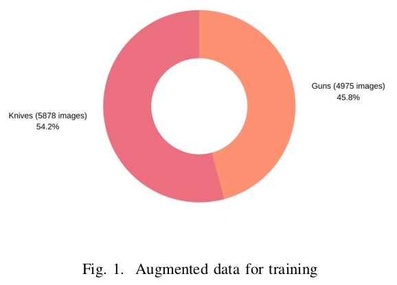
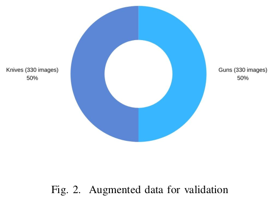
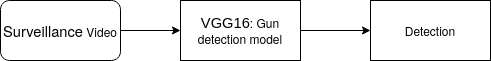
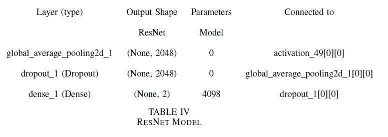
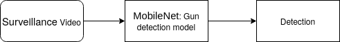
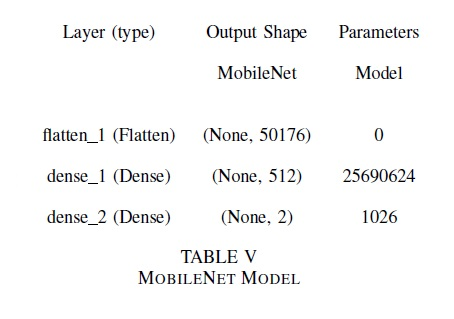

# Firearm-detection

Gun Dataset: http://www.mediafire.com/file/pvfircmboaelkxc/Gun_data_labeled.zip/file  
Knife Dataset: http://kt.agh.edu.pl/matiolanski/KnivesImagesDatabase/

<h5> Introduction </h5>
Closed-circuit television (CCTV) systems are normally created with more than one surveillance camera connected to the CCTV system. The central system receives video streams from all the surveillance cameras simultaneously. Traditionally, a security guard is answerable for monitoring the streams returning from all the security cameras. If any dangerous scenario is discovered, then the safety guard initiates the routines informed to them. Therefore, we will say that the machine is completely depending on the safety guard. it’s been proved that after 12 min of non-stop tracking of the watching activity, the accuracy is decreased by way of 45% and the accuracy can similarly be reduced to 95% after 22 min. Thus, it is critical to have a monitoring system that can assist the security guard to track the dangerous scenario and help in mitigating the destruction that could happen. The proposed models detect a firearm in the video flow. The video move is divided into more than one frame and each frame is surpassed via the proposed model. The proposed model detects whether or not the firearm is present within the frame. If the firearm is detected the proposed model will detect the firearm and give a sign to the safety guard. The proposed model is dependent on the quality of the video acquired from the surveillance cameras. Many CCTV machine customers use low-first-rate surveillance cameras. The low-quality surveillance cameras provide low-quality video stream that impacts the frames retrieved from the video streams. The low-quality frames affect firearm detection accuracy and may provide incorrect outcomes that can be harmful. In many cases, the commercial enterprise owners deploy a CCTV gadget without extra tracking offerings. This may be less effective in figuring out risky scenarios. Thus, it’s crucial to improve a system such that the system can detect dangerous activities and alert the safety guard or relevant authorities.

<h5> Dataset: </h5>
In the dataset we used Gun dataset as positive dataset and knife dataset as negative images.
</img>
 
</img>
 
<h5> Preparing Models: </h5>
<h6>VGG 16 Model:</h6>
we trained the model on VGG16 architecture. The proposed model gave 97% accuracy on the validation dataset. The models proposed in previous papers gave an accuracy of up to 87%. The proposed system can predict the firearm with an accuracy of 97%. The proposed system can be used in surveillance cameras for detecting the gun. The surveillance cameras are used in a variety of locations, such as malls, cinema theaters, buildings, etc. In the VGG16 model, there are 135 million parameters to be trained for detecting the gun in an image. We used ‘ReLU’ as an activation function in the convolutional layers and ‘softmax’ as an activation function in the output layer. We used Adam (lr=0.0001) as an optimization function. We used ‘categorical cross-entropy’ as a loss function. We trained the model up to 10 epochs.
 
 </img>

<h6>ResNet Model:</h6>
ResNet arcitechure and the proposed model gave 95.6% accuracy on a validation dataset. The ResNet model can be used in surveillance cameras for detecting firearms. In the ResNet model, there are 23.5 million parameters to be trained and 53 thousand non-trainable parameters. We used ‘softmax’ as an activation function in the output layer. We used Adam (lr=0.001) as an optimization function. We used ‘categorical cross-entropy’ as a loss function. We trained the model up to 30 epochs. We added one GlobalAveragePooling2D layer and a dropout (0.7) before the output layer to avoid overfitting
 
</img>
<h7>ResNet Archietcure:</h7>
</img>

<h6>MobileNet Model:</h6>
MobileNet model was proposed with the aid of google. The MobileNet model was proposed such that it can be used on an embedded system with less processing powers and memory. The proposed model gave 99% accuracy on a validation dataset. The MobileNet model can be used in surveillance cameras, embedded devices, etc.. In the MobileNet model, there are 28.8 million parameters to be trained and 22 thousand non-trainable parameters. We used ‘ReLU’ as an activation function in the convolutional layers and ‘softmax’ as an activation function in the output layer. We used Adam (lr=0.001) as an optimization function. We used ‘categorical cross-entropy’ as a loss function. We trained the model up to 40 epochs. We added one more dense layer before the output layer.
 
</img>

<h7>MobileNet Archietcure:</h7>
 
</img>

<h5>Results</h5>
<h6>VGG 16 Model:<h6>
</img>
<h6>ResNet Model:<h6>
</img>
<h6>MobileNet Model:<h6>
</img>
 
