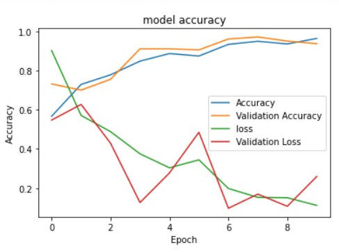
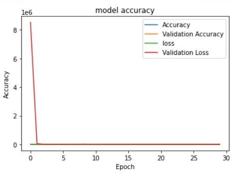
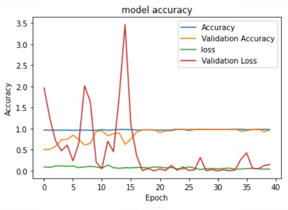

# Firearm-detection

Gun Dataset: http://www.mediafire.com/file/pvfircmboaelkxc/Gun_data_labeled.zip/file  
Knife Dataset: http://kt.agh.edu.pl/matiolanski/KnivesImagesDatabase/

<h5> Introduction </h5>
Closed-circuit television (CCTV) systems are normally created with more than one surveillance camera connected to the CCTV system. The central system receives video streams from all the surveillance cameras simultaneously. Traditionally, a security guard is answerable for monitoring the streams returning from all the security cameras. If any dangerous scenario is discovered, then the safety guard initiates the routines informed to them. Therefore, we will say that the machine is completely depending on the safety guard. it’s been proved that after 12 min of non-stop tracking of the watching activity, the accuracy is decreased by way of 45% and the accuracy can similarly be reduced to 95% after 22 min. Thus, it is critical to have a monitoring system that can assist the security guard to track the dangerous scenario and help in mitigating the destruction that could happen. The proposed models detect a firearm in the video flow. The video move is divided into more than one frame and each frame is surpassed via the proposed model. The proposed model detects whether or not the firearm is present within the frame. If the firearm is detected the proposed model will detect the firearm and give a sign to the safety guard. The proposed model is dependent on the quality of the video acquired from the surveillance cameras. Many CCTV machine customers use low-first-rate surveillance cameras. The low-quality surveillance cameras provide low-quality video stream that impacts the frames retrieved from the video streams. The low-quality frames affect firearm detection accuracy and may provide incorrect outcomes that can be harmful. In many cases, the commercial enterprise owners deploy a CCTV gadget without extra tracking offerings. This may be less effective in figuring out risky scenarios. Thus, it’s crucial to improve a system such that the system can detect dangerous activities and alert the safety guard or relevant authorities.

<h5>Results</h5>
<h6>VGG 16 Model:<h6>
</img>
<h6>ResNet Model:<h6>
</img>
<h6>MobileNet Model:<h6>
</img>
 
